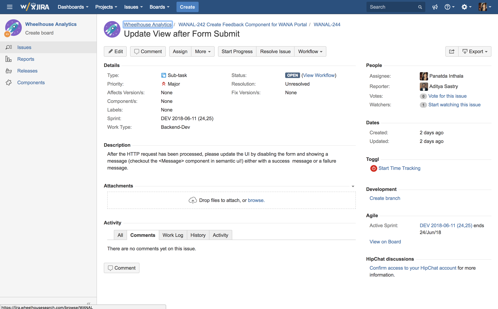
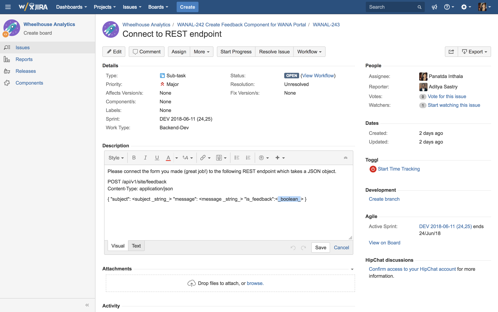
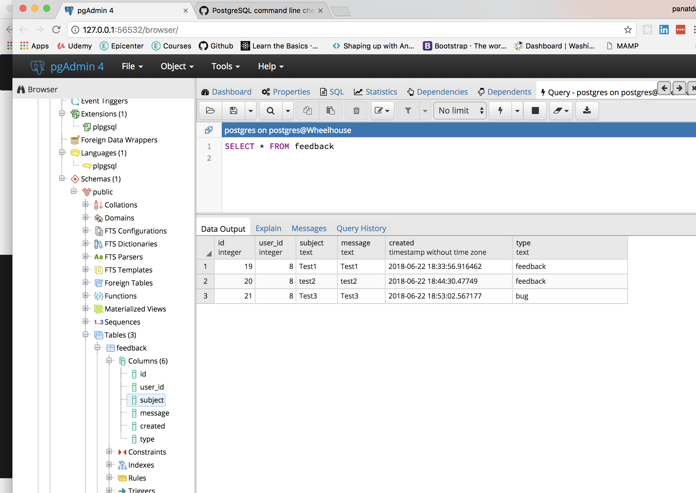
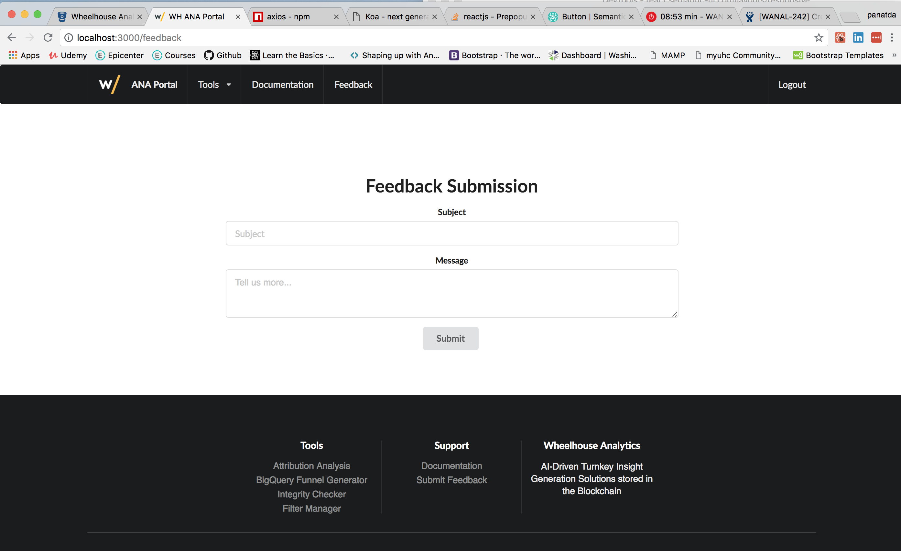
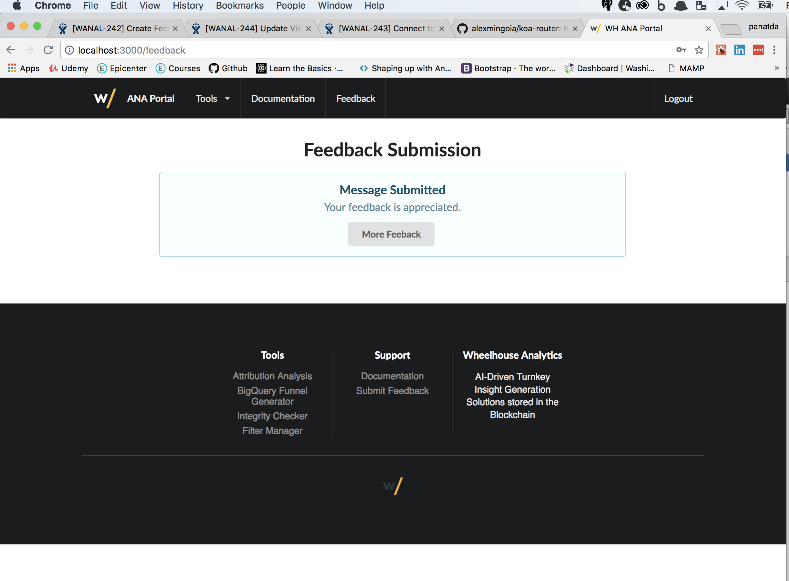

# feedback-form-react

JULY 5TH 2018

#### _React, PostgreSQL, Koa, Axios, Semantic-Ui-React_ 

#### By _**Panatda Inthala**_

## Description

Design & created Mockup for FeedBack Component and built in via React. Worked on server, client side, parts of user authorization and linked form to PostgreSQL.

## Project ScreenShots

## Setup/Installation Requirements

1. Clone this repository from GitHub.

2. Run npm install to install dependencies required to run the simple app.

3. Run npm run start and go to localhost:3000 to view the app. (You'll need login information)

## Known Bugs

* No known bugs at this time.

## Technologies Used
*  Semantic UI
*  Javascript
*  JSX
*  REACT
*  POSTGRESSQL
*  AXIOS
*  KOA

## Support and Contact Details

_All feedback is welcomed. If you have any feedback pertaining to this project; such an suggestions and improvements, feel free to contact me via email at panatdainthala@gmail.com._

### License

*This software is licensed under the MIT license.*

Copyright (c) 2018 **Panatda Inthala**
